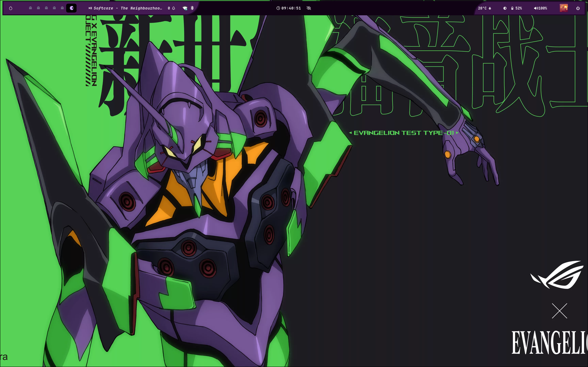
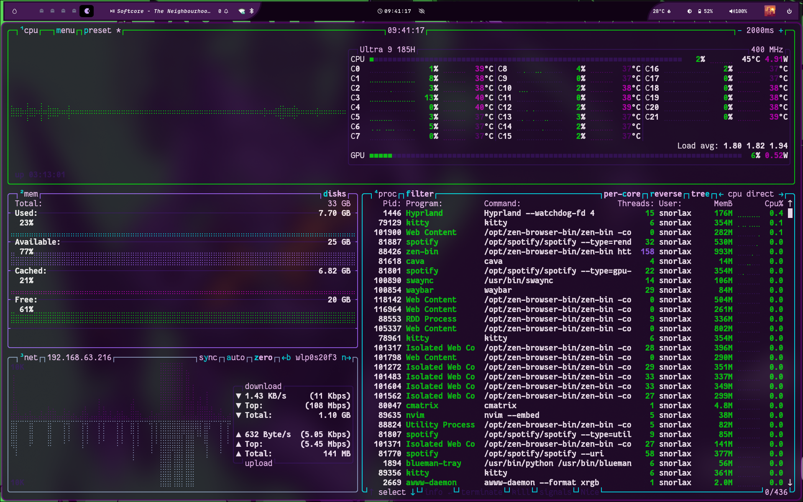
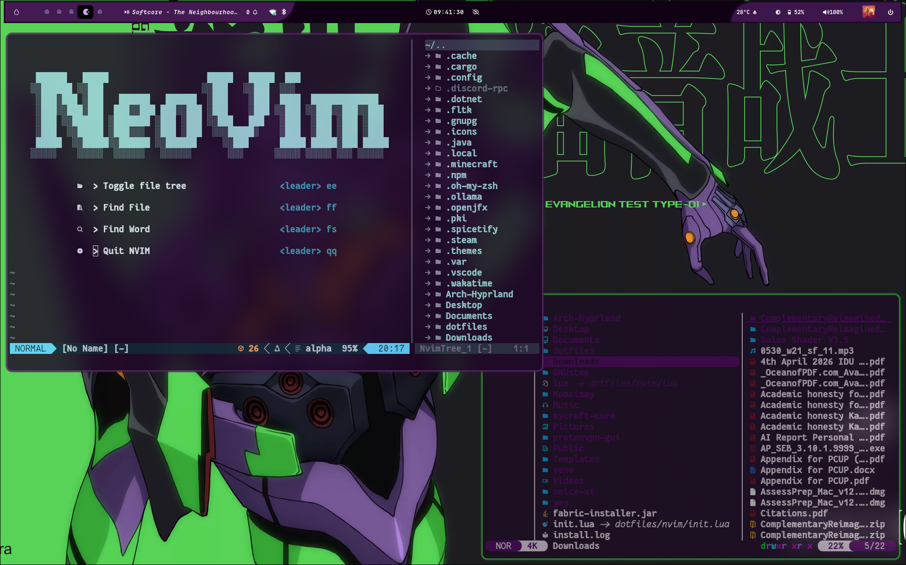
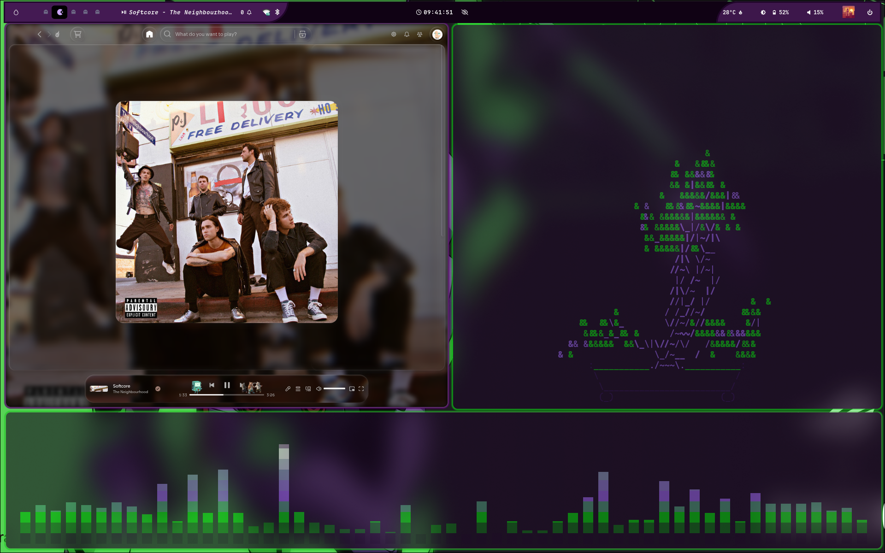
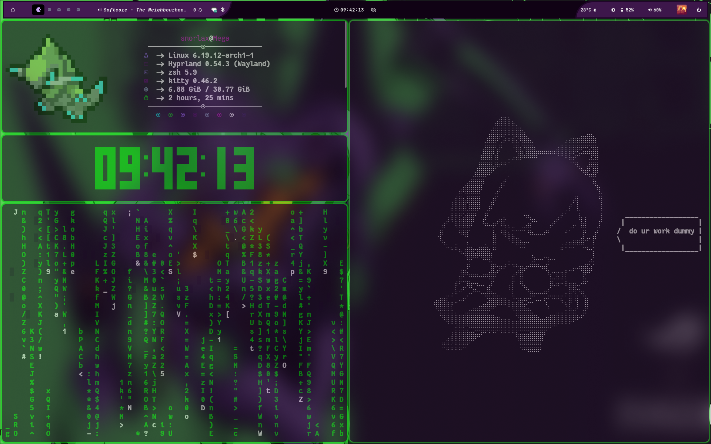

# My Dotfiles

This repository contains the dotfiles I use to setup my Terminal workflow on my Linux system(Evangelion inspired)

## Preview

## Dotfiles Included
- **Neovim**: Code\Text Editor.
- **Tmux**: Session and Window manager in Terminal.
- **Kitty**: Primary Terminal Emulator.
- **Alacritty**: Terminal emulator.
- **Cava**: Audio visualizer.
- **Yazi**: Terminal file manager
- **ZSH**: Shell

Taken inspiration from(nvim and yazi):
https://github.com/shorya-1012/dotfiles

Uses this shell:
https://github.com/JaKooLit/Arch-Hyprland
